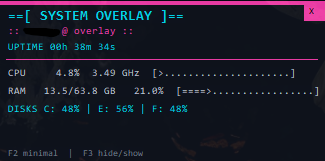

# 📊 WIDGET-Monitor_Perfomance_Overlay v2.0

<div align="center">


**Un moniteur de performances système léger et moderne pour Windows 11**

*Overlay transparent en temps réel • Zero dépendances • Codé en Vibecoding avec Claude AI*

[Fonctionnalités](#-fonctionnalités) • [Installation](#-installation) • [Utilisation](#-utilisation) • [Compilation](#-compilation)

</div>

---

## 📸 Aperçu



## ✨ Fonctionnalités

### **Métriques en Temps Réel** (9 indicateurs)
- 🖥️ **CPU** : Utilisation (%) + Fréquence (GHz)
- 💾 **RAM** : Utilisée/Totale (GB) + Pourcentage
- 🎮 **GPU** : Nom de la carte graphique
- 💿 **Disque** : Utilisation du disque C:
- 📊 **Processus** : Nombre de processus actifs
- 🔊 **Volume** : Volume système avec barre visuelle
- 🕐 **DateTime** : Date et heure en temps réel
- ⏱️ **Uptime** : Temps depuis le démarrage système
- 📈 **Barres visuelles** : Indicateurs colorés (vert/orange/rouge)

### **Interface Moderne**
- 🎨 Design Windows 11 (fond sombre, bordure bleue)
- 🔄 Barres de progression dynamiques
- 🪟 Fenêtre semi-transparente toujours au premier plan
- 🖱️ Déplacement par glisser-déposer
- 🎯 Mode minimal et mode complet

### **Performances**
- ⚡ Ultra léger : **< 50 KB** compilé
- 🚀 Consommation CPU : **< 1%**
- 💨 Consommation RAM : **~2-3 MB**
- 🔄 Mise à jour : **Toutes les 2 secondes**
- 📦 **Zero dépendance** externe

### **Productivité**
- 🔑 Raccourcis clavier personnalisés
- 💾 Sauvegarde automatique de la position
- 🚀 Démarrage automatique avec Windows
- ⚙️ Configuration persistante

---

## 🚀 Installation

### **Téléchargement**

1. Téléchargez la dernière version depuis [Releases](../../releases)
2. Extrayez `PerformanceOverlay_v2.exe`
3. Double-cliquez pour lancer

### **Compilation depuis les sources**

#### **Prérequis**
- **MinGW-w64** ou **MSVC** (Visual Studio)
- **Make** (optionnel, recommandé)
- **windres** (inclus avec MinGW)

#### **Installation rapide avec Chocolatey**
```powershell
choco install mingw make -y
```

#### **Compilation**

**Avec Make (recommandé)** :
```bash
make           # Compiler
make run       # Compiler et lancer
make clean     # Nettoyer
make rebuild   # Recompiler complètement
```

**Sans Make** :
```bash
gcc -Wall -O2 -mwindows -Iinclude -o PerformanceOverlay_v2.exe \
    src/main.c src/performance.c src/config.c src/startup.c \
    -lgdi32 -luser32 -ladvapi32 -lpsapi

windres resources.rc -o build/resources.o
```

---

## 🎮 Utilisation

### **Raccourcis Clavier**
| Touche | Action |
|--------|--------|
| **F2** | Basculer mode minimal ↔ complet |
| **F4** | Basculer entre page Perf et Task Killer |
| **Clic + Glisser** | Déplacer la fenêtre |
| **Clic sur X** | Fermer l'application |

### **Task Killer** (nouveau)
- Liste tous les processus (triés par RAM) ou uniquement ceux avec ports ouverts
- Filtrage par nom de processus
- Kill de processus en un clic
- Protection des processus système critiques

### **Modes d'Affichage**

#### **Mode Complet** (par défaut)
Affiche toutes les métriques :
- CPU avec fréquence
- RAM détaillée (GB)
- Disque
- Uptime
- Nombre de processus

#### **Mode Minimal** (F2)
Affiche uniquement :
- CPU
- RAM

### **Configuration**

La configuration est sauvegardée automatiquement dans `config.txt` :
```
x=100          # Position horizontale
y=100          # Position verticale
minimal_mode=0 # 0=complet, 1=minimal
```

---

## 📁 Structure du Projet

```
performance-overlay/
├── src/
│   ├── main.c              # Interface graphique (GDI)
│   ├── performance.c       # Monitoring système (7 métriques)
│   ├── config.c            # Gestion configuration
│   └── startup.c           # Démarrage automatique Windows
├── include/
│   ├── performance.h       # Déclarations monitoring
│   ├── config.h            # Structure de configuration
│   └── startup.h           # Fonctions de démarrage
├── build/                  # Fichiers compilés (généré)
├── icon.ico                # Icône de l'application
├── resources.rc            # Ressources Windows
├── Makefile                # Automatisation de build
├── .gitignore              # Fichiers ignorés par Git
├── README.md               # Ce fichier
├── GUIDE_PEDAGOGIQUE.md    # Guide d'apprentissage C
└── GUIDE_UTILISATION.md    # Manuel utilisateur détaillé
```

---

## 🛠️ Technologies Utilisées

- **Langage** : C (C99)
- **API** : Win32 API (Windows native)
- **Interface** : GDI (Graphics Device Interface)
- **Monitoring** :
  - `GetSystemTimes()` - CPU système
  - `GlobalMemoryStatusEx()` - RAM
  - `GetDiskFreeSpaceEx()` - Disque
  - `EnumProcesses()` - Processus
  - `GetTickCount64()` - Uptime
- **Compilateur** : GCC (MinGW-w64) ou MSVC

---

## 📚 Documentation

- **[GUIDE_UTILISATION.md](GUIDE_UTILISATION.md)** - Guide complet d'utilisation quotidienne
- **[GUIDE_PEDAGOGIQUE.md](GUIDE_PEDAGOGIQUE.md)** - Tutoriel d'apprentissage du C (714 lignes)

---

## 🐛 Problèmes Connus

### **Cache d'icônes Windows**
Si l'icône ne se met pas à jour après compilation :
```powershell
.\refresh_icon.bat
```

### **Conflit F1 sous Windows 11**
La touche F1 ouvre l'aide Windows par défaut. Utilisez **F3** à la place.

---

## 🔜 Roadmap

### **Version 2.1** (à venir)
- [ ] Réseau : Vitesse download/upload
- [ ] Graphiques : Courbes historiques (60s)
- [ ] Multi-moniteurs : Support écrans secondaires

### **Version 3.0** (futur)
- [ ] GPU : Utilisation NVIDIA/AMD
- [ ] Température : Monitoring thermique
- [ ] Thèmes : Mode clair/sombre
- [ ] Menu contextuel : Paramètres avancés

---

## 🤝 Contribution

Les contributions sont les bienvenues !

1. Fork le projet
2. Créez une branche (`git checkout -b feature/amelioration`)
3. Commitez vos changements (`git commit -m 'Ajout fonctionnalité'`)
4. Push vers la branche (`git push origin feature/amelioration`)
5. Ouvrez une Pull Request

---

## 📜 License

Ce projet est sous licence **MIT**. Voir le fichier [LICENSE](LICENSE) pour plus de détails.

---

## 👤 Auteur

[@dexteee-r](https://github.com/dexteee-r)

---

## ⭐ Remerciements

- Inspiré par les outils de monitoring système
- Conçu pour l'apprentissage du C et de Win32 API
- Optimisé pour Windows 11

---

<div align="center">

**Si ce projet vous aide, n'hésitez pas à mettre une ⭐ !**

</div>
